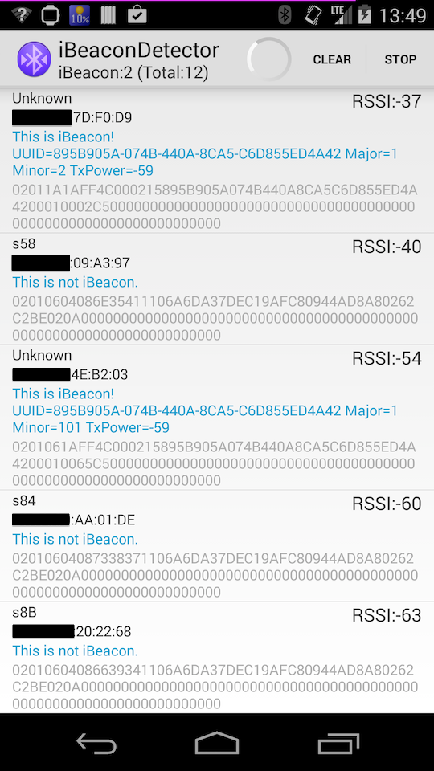

iBeaconDetector
=====
Scan Bluetooth Low Energy Peripherals, detect iOS iBeacon.
Sorted Beacon List by RSSI, you can check UUID is correct or not.

https://play.google.com/store/apps/details?id=youten.redo.ble.ibeacondetector

# License
Apache License Version 2.0
